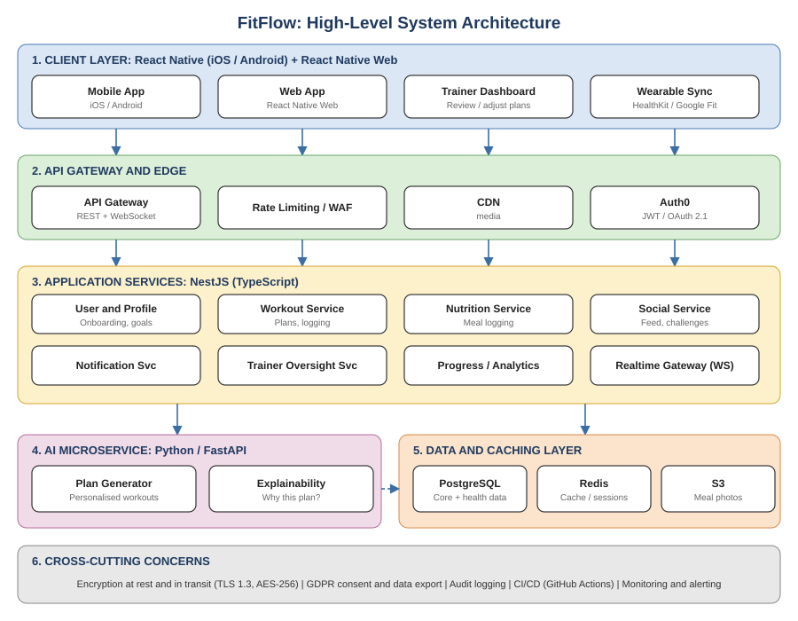

# FitFlow Redesign

Redesign of the FitFlow fitness app for **IT3060 Human Computer Interaction (Lab Exercise 05)**.
This repository holds the technology decisions, architecture and supporting documents for the redesign.

## Recommended Tech Stack

| Layer | Technology |
|-------|-----------|
| Frontend | React Native + React Native Web |
| Backend API | NestJS (Node.js / TypeScript) |
| AI Service | Python / FastAPI |
| Database | PostgreSQL |
| Cache / Real-time | Redis |
| Object Storage | S3 |
| Authentication | Auth0 |

Weighted decision score: **4.55 / 5** (see the comparison matrix for the full scoring).

## Architecture



## Documentation

- [Tech Stack Summary](docs/tech-stack-summary.md)
- [Comparison Matrix](docs/comparison-matrix.md)
- [ADR-001: Technology stack decision](docs/adr/ADR-001-tech-stack.md)
- Lab reports 01 to 05 (user research, personas and requirements, wireframes, usability testing, tech stack)

## Folder Structure

```
fitflow-redesign/
├── frontend/      React Native + React Native Web client
├── backend/       NestJS API services
├── ai-service/    FastAPI microservice (workout plans, explainability)
├── docs/
│   ├── adr/       Architecture Decision Records
│   └── diagrams/  Architecture diagram
├── .github/workflows/ci.yml
├── .gitignore
└── README.md
```

## Getting Started

The application code is not implemented yet. The commands below are the intended setup once development starts.

```bash
# Frontend
cd frontend && npm install && npm start

# Backend
cd backend && npm install && npm run start:dev

# AI service
cd ai-service && pip install -r requirements.txt && uvicorn app.main:app --reload
```

## Continuous Integration

A GitHub Actions workflow (`.github/workflows/ci.yml`) runs on every push and pull request to `main`. It checks that the required documents exist and that the AI service dependencies install and the entry file compiles.

## Licence

Academic coursework. Not licensed for production use.
